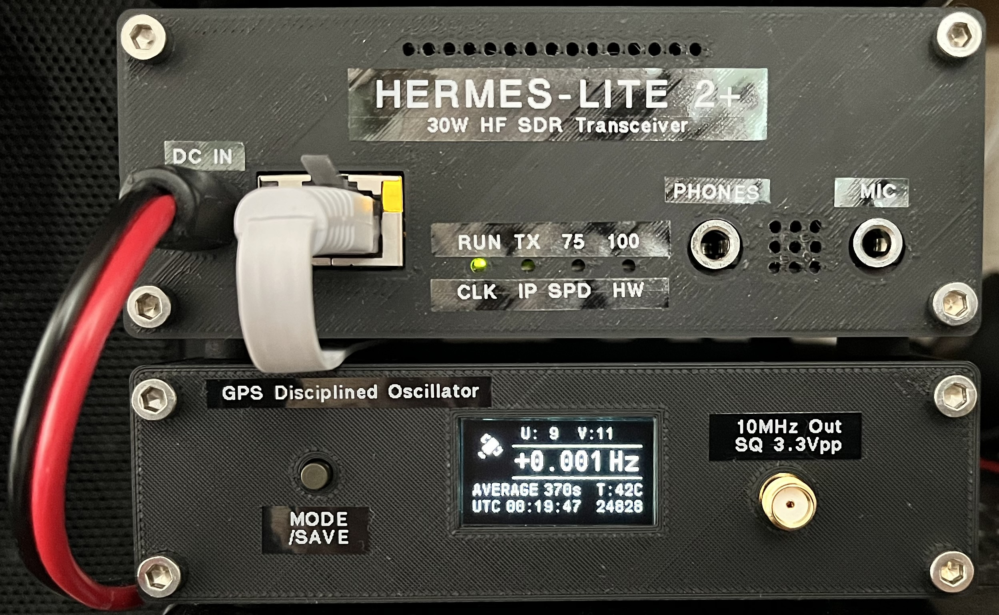
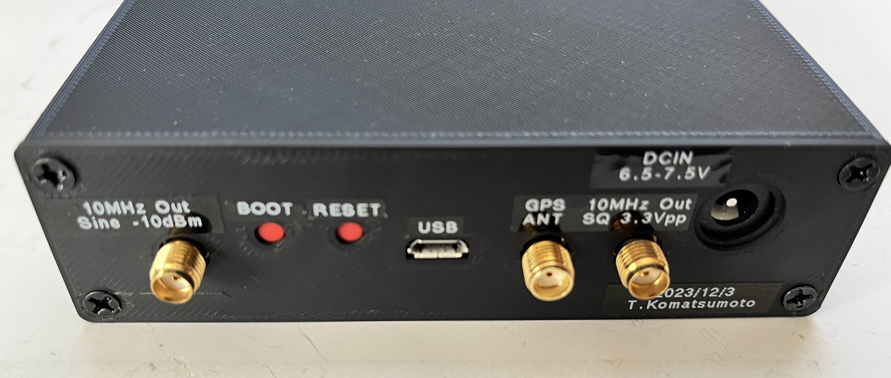
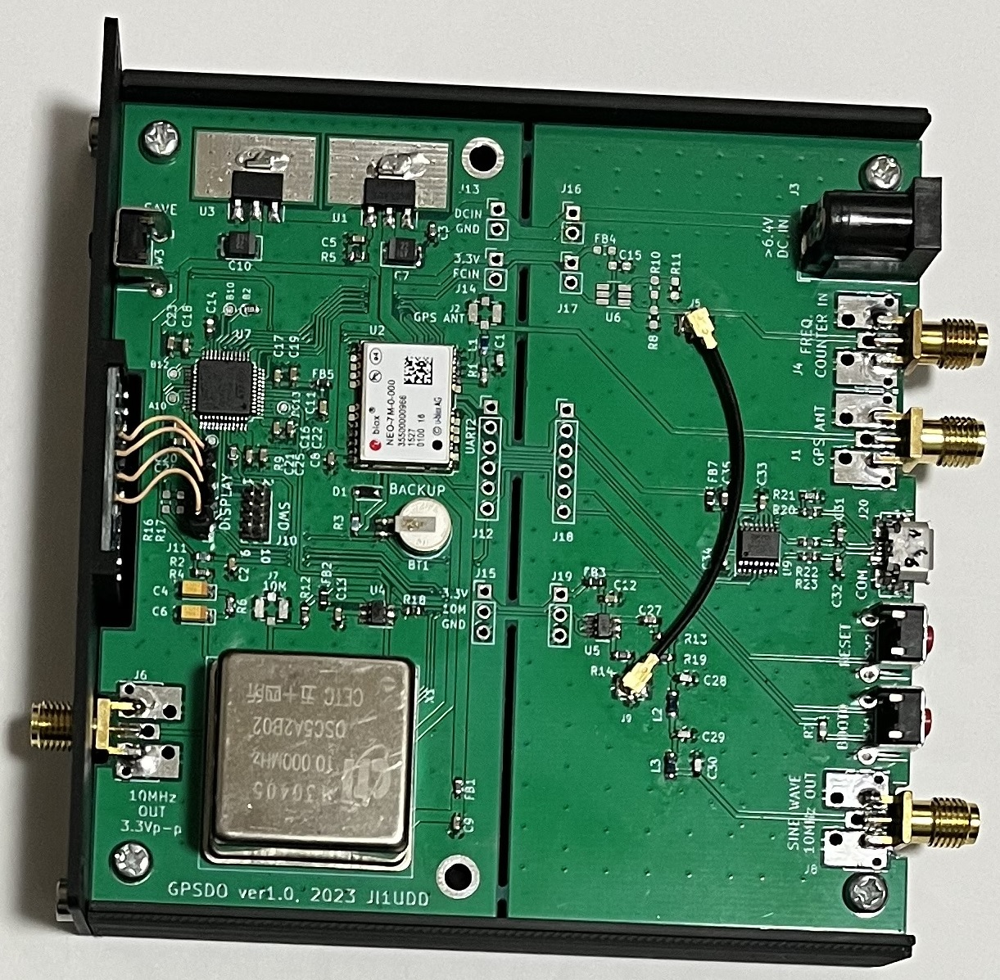
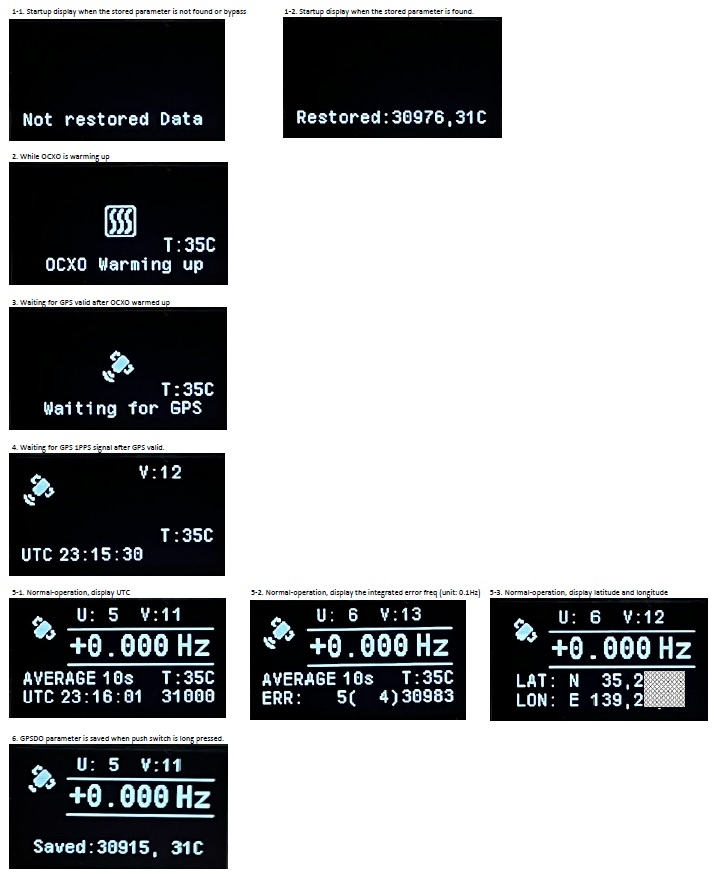
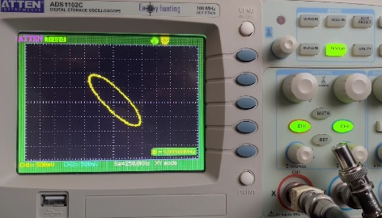
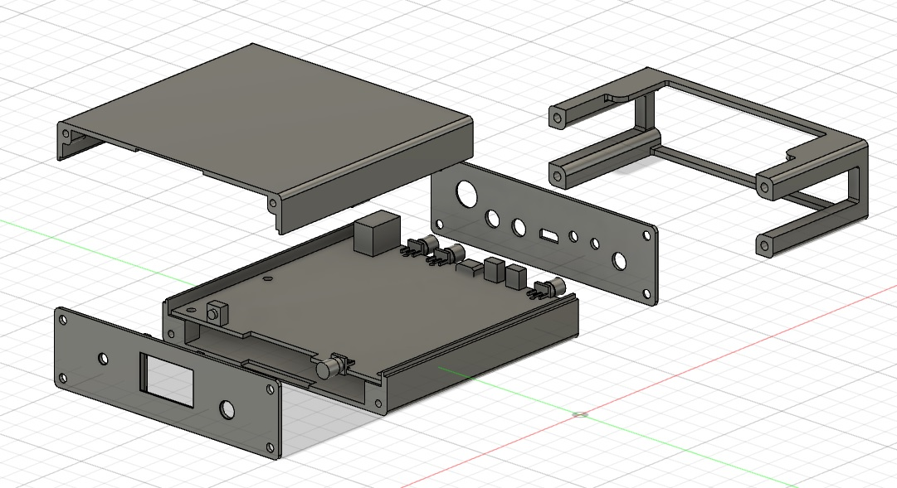

# GPSDO
## GPSDO for Hermes-Lite2 and a measuring instrument    
[Youtube video](https://youtu.be/AfCz8ohrafM)  

  

GPSDO using a cheap used OCXO purchased from Aliexpress. It has 10MHz square wave output that can be directly connected to the external clock input of Hermes-Lite2 and 10MHz sine wave output (-10 dBm @ 50 ohm) that can be connected to a measuring instrument such as a spectrum analyzer.

  

The 10MHz input SMA connector is located on the back panel of my HL2+. Also, my GPSDO has 10MHz output SMA connector not only on the front panel but also on the back panel. Therefore, these back connectors are connected using a coaxial cable.

  

## Operation
1. After powering on, wait for the OCXO to warm up to the preset temperature. The default temperature setting is 30 degree C.
2. Next, wait for 1PPS signal from GPS.
3. OCXO frequency control is performed using 1PPS signal. This state is called normal state.
4. During normal state, display mode can be switched by pressing MODE/SAVE button shortly. Display modes are UTC display, frequency integration error display (unit: 0.1Hz) for monitor, latitude and longitude display.
5. During normal state, by pressing MODE/SAVE button longly, the current OCXO temperature minus 5 degree C is saved to STM32 non-volatile memory as the preset temperature. Also the current OCXO control parameter (PWM value) is saved as the initial PWM value. By saving the normal state OCXO temperature and control parameters, it will take less time to stabilize the frequency after cold start. On the other hand, by pressing and holding the MODE/SAVE button while turning on the power, the preset values stored in STM32 non-volatile memory is ignored.

## OLED display
10MHz frequency error and GPSDO status are displayed on the OLED.
 

## Performance
I checked the accuracy of the frequency of GPSDO output. I made two GPSDOs. Their sine wave outputs are each synchronized to GPS. I input them into my oscilloscope and had them draw a Lissajous curve. Since the Lissajous curve is extremely stable and can take more than 1000 seconds to complete one rotation, I confirmed that the frequency error is on the order of millihertz.  
 

## STM32 programming
Object files (STM32F410_GPSDO.elf) can be programmed using ST-LINK or USB serial (COM port).

## Enclosure
It's made with 3D printer. The parts of an extender is used for stacking HL2plus over GPSDO. 

  